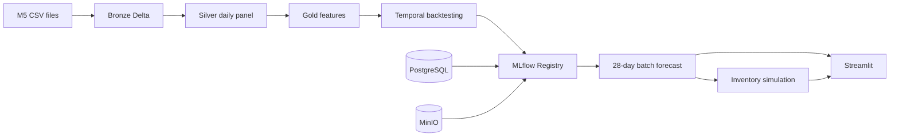

# Retail Demand Forecasting and Inventory Optimization

An end-to-end retail forecasting platform that runs locally and mirrors the working patterns of
Databricks, Delta Lake, and MLflow. It ingests the M5 dataset, builds a medallion lakehouse,
evaluates global forecasting models through temporal backtesting, explains their predictions,
and turns the selected forecast into inventory decisions.

## Resumen ejecutivo

Este proyecto reproduce en local un flujo productivo de forecasting retail. Los datos M5 se
procesan con Spark y Delta Lake en capas Bronze, Silver y Gold. Los experimentos, modelos y
promociones se gestionan con MLflow, PostgreSQL y MinIO. El sistema compara baselines,
LightGBM y XGBoost, genera explicaciones y simula políticas de reposición con supuestos de
inventario configurables. N-HiTS se conserva como experimento histórico, pero está desactivado
porque fue el candidato más lento y el de peor calidad. La misma lógica se ejecuta desde CLI y
notebooks documentados.

### Cómo interpretar SKU-store-day y WAPE

`SKU-store-day` significa las unidades de un producto concreto, en una tienda concreta, durante
un día concreto. Es la granularidad necesaria para decidir la reposición de ese producto, pero
también es la señal más ruidosa del proyecto. En el backtest, el 57,2% de esas observaciones son
cero.

WAPE divide la suma de errores absolutos entre la demanda total. Por ejemplo, para demanda
`[0, 0, 0, 0, 0, 0, 7]` y predicción `[1, 1, 1, 1, 1, 1, 1]`, el error absoluto suma 12 y la
demanda suma 7: WAPE es 171%. Por tanto, WAPE no está limitado al 100%. Una predicción suavizada
se penaliza en los días sin venta y también cuando no anticipa el pico.

`Store-day` agrega todos los productos de la tienda antes de calcular el error. Las
sobrepredicciones de unos productos compensan parcialmente las infrapredicciones de otros. Por
eso el champion obtiene 15,15% en store-day y 72,21% en SKU-store-day. El primer valor sirve para
planificación agregada de tienda; no demuestra precisión en la reposición de cada producto.

Para mejorar el nivel SKU-store-day faltarían, sobre todo, disponibilidad y roturas de stock,
ventas perdidas, promociones y exposición, inventario y pedidos históricos, lanzamientos y bajas
de surtido, sustitución entre productos y variables locales. M5 registra ventas, que no siempre
son iguales a demanda: una venta cero puede significar falta de interés o falta de stock.

## Architecture



Spark 3.5 and Delta Lake 3.3 provide the local lakehouse. MLflow stores metadata in PostgreSQL
and model artifacts in the S3-compatible MinIO service. The pipeline, JupyterLab, and dashboard
share the same code, configuration, volumes, and MLflow tracking endpoint.

Docker uses small multi-stage targets instead of one universal image. Spark nodes contain only
the lakehouse stack, MLflow and Streamlit have dedicated runtimes, and Jupyter extends the
training image. The default `dev` pipeline and Jupyter targets do not install PyTorch or
NeuralForecast. The archived N-HiTS experiment requires an explicit GPU/deep image build;
LightGBM and XGBoost remain available in the smaller default images.

## Quick start

Prerequisites are Docker Desktop and the five M5 files in `data/`. NVIDIA drivers and Docker GPU
support are required only for explicitly built optional GPU targets.

```powershell
Copy-Item .env.example .env
docker-compose build
docker-compose up -d postgres minio minio-init mlflow spark-master spark-worker
docker-compose run --rm pipeline retail-forecast preflight --profile dev
docker-compose run --rm pipeline retail-forecast pipeline run --profile dev
docker-compose up -d dashboard jupyter
```

Build the CUDA targets only when running the full profile:

```powershell
docker compose --profile full build pipeline-gpu jupyter-gpu
docker compose --profile full run --rm pipeline-gpu
```

Open the local services after the health checks pass:

| Service | URL |
| --- | --- |
| Streamlit | `http://localhost:8501` |
| MLflow | `http://localhost:5000` |
| JupyterLab | `http://localhost:8888` |
| Spark master | `http://localhost:8080` |
| MinIO console | `http://localhost:9001` |

MinIO uses the local development credentials from `.env`: username `minio` and password
`minio-local-only` with the default configuration. These credentials are only intended for the
local portfolio environment.

In MLflow, open the `M5 Retail Forecasting - DEV` experiment. The authoritative results are the
runs prefixed with `OFFICIAL` and `CHAMPION`; incomplete and earlier retry runs are explicitly
labelled `FAILED` or `SUPERSEDED`.

The pipeline is restartable. A completed stage is skipped when its configuration fingerprint has
not changed. Use `--force` only when a deliberate rebuild is required.

## Profiles

`dev` selects 300 SKU-store series per state, keeps the production graph on CPU, uses three
Optuna trials, and targets a 15 to 30 minute feedback loop. `full` processes all 30,490 series,
uses the optional CUDA image, runs twelve tuning trials, and targets a one to four hour run.
`test` is a small integration profile used by CI.

Configuration is layered from `config/base.yaml` and one profile file. Paths, forecast horizon,
folds, features, promotion guardrails, and inventory assumptions are validated by Pydantic before
a stage starts.

## CLI

```text
retail-forecast preflight --profile dev
retail-forecast data download --profile dev
retail-forecast data validate --profile dev
retail-forecast pipeline run --profile dev [--from silver] [--to forecasting] [--force]
retail-forecast pipeline status --profile dev
retail-forecast model backtest --profile dev
retail-forecast model train --profile dev
retail-forecast model finalize --profile dev
retail-forecast model evaluate --profile dev [--mlflow-run-id <existing-run-id>]
retail-forecast model promote --profile dev --run-id <mlflow-run-id>
retail-forecast forecast run --profile dev
retail-forecast inventory simulate --profile dev
retail-forecast notebooks run --profile dev --notebook all
```

## Notebooks

The `notebooks/` directory contains an editable sequence from environment validation through
inventory optimization. Each notebook has a Papermill parameters cell, explains the relevant
decision and leakage risk, and calls the tested package functions. Executed copies are written to
`artifacts/notebooks/` and are not committed.

The model notebooks launch real MLflow experiments. The backtesting notebook runs the complete
selection policy and the final forecast notebook materializes the registered result. Business
logic is not duplicated in cells.

Source notebooks default to analysis-only mode through `execute_stage = False`, so opening and
running an EDA notebook reuses existing Delta tables. The `notebooks run` CLI overrides this to
`True` for a reproducible end-to-end notebook execution. Bronze, Silver, Gold, and backtesting
include source audits, transformation contracts, feature definitions, normalization decisions,
leakage checks, demand-regime analysis, and explicit limitations.

## Evaluation and promotion

Backtests use origins `d_1857`, `d_1885`, and `d_1913`, each with a 28-day horizon. WRMSSE is
calculated over the 12 official M5 levels using bottom-up coherent forecasts. MAE, RMSE, WAPE,
bias, 90 percent interval coverage, interval width, and fold degradation provide diagnostic
context.

The Registry alias `champion` is updated only when the candidate improves WRMSSE by at least one
percent and satisfies the configured bias, coverage, and fold guardrails. The forecast job writes
continuous demand expectations; inventory rules decide any operational rounding.

## Reproduced dev results

The following results were produced locally on 2026-08-09 from 900 stratified M5 SKU-store
series. They describe the reproducible `dev` profile and are not presented as full-dataset M5
benchmark scores. The promoted MLflow backtest run is `2dbd860a036d4cfca9b43ecf305b1f26`.

| Model | WRMSSE | SKU-store-day WAPE | Store-day WAPE | MAE | Bias | 90% coverage |
| --- | ---: | ---: | ---: | ---: | ---: | ---: |
| XGBoost | **0.7827** | 72.21% | **15.15%** | 1.050 | **-0.82%** | 90.99% |
| LightGBM | 0.8173 | **71.57%** | 15.18% | **1.041** | -3.38% | 90.54% |
| Moving average | 1.0298 | 73.24% | 19.93% | 1.065 | -1.87% | 88.90% |
| Seasonal naive | 1.0488 | 85.06% | 19.64% | 1.237 | -6.33% | 92.26% |
| N-HiTS | 2.3129 | 113.21% | 46.83% | 1.651 | 31.65% | 86.38% |

Temporal demand-level calibration removed the systematic tree under-forecast without using the
evaluation fold. XGBoost passed every promotion guardrail, was registered as
`retail-demand-forecaster` version 5, and now carries the `champion` alias. The champion produced
25,200 bottom-level forecasts for `d_1942` through `d_1969`, representing 34,642 median forecast
units.

The champion's 72.21% bottom-level WAPE is not production-quality. Its 15.15% store-day WAPE is
appropriate for aggregate store planning, but it must not be presented as item-level accuracy.
In the stored evaluation, 57.2% of SKU-days have zero demand, but intermittency does not fully
explain the weakness: WAPE is still 57.9% for the densest series. The current alias therefore
identifies the best candidate under the configured promotion rules, not a model ready for
SKU-level operational deployment.

The inventory simulation compared the champion with seasonal naive across 900 series and 28
days. XGBoost reached a 96.90% mean fill rate with 25.84 average units on hand and a total
simulated cost of 14,912.75. Seasonal naive reached 97.18%, held 33.14 units on average, and cost
15,213.73. Under the current cost assumptions, XGBoost reduces inventory and total cost with a
small service-level tradeoff.

Additional decision metrics are calculated from the same stored out-of-sample folds; no model is
retrained to produce this table. Pinball loss evaluates the complete probabilistic forecast and
bottom RMSSE reports the unweighted SKU-store scale-adjusted error.

| Model | Bottom RMSSE | Mean pinball loss |
| --- | ---: | ---: |
| XGBoost | 0.733 | **0.308** |
| LightGBM | **0.731** | 0.312 |
| Moving average | 0.737 | 0.329 |
| Seasonal naive | 0.963 | 0.384 |
| N-HiTS, historical | 1.127 | 0.448 |

| Inventory policy | Fill rate | Stockout rate | Average inventory | Lost sales | Total cost |
| --- | ---: | ---: | ---: | ---: | ---: |
| XGBoost | 96.90% | 0.93% | **25.84** | 2,030.7 | **14,912.75** |
| Seasonal naive | **97.18%** | **0.64%** | 33.14 | **1,523.0** | 15,213.73 |

The inventory result exposes the tradeoff explicitly: XGBoost lowers inventory and total cost,
while seasonal naive produces slightly fewer stockouts and lost sales.

## Data and generated artifacts

M5 source files, Delta tables, service state, models, executed notebooks, and credentials are
ignored by Git. The source data is validated by filename, schema, size, and checksum. See
[`docs/data-contracts.md`](docs/data-contracts.md) for the table contracts and
[`docs/operations.md`](docs/operations.md) for recovery procedures.

## Development

```powershell
docker-compose run --rm pipeline ruff check src tests app
docker-compose run --rm pipeline mypy src
docker-compose run --rm pipeline pytest -m "not integration and not notebook"
docker-compose run --rm pipeline pytest -m integration
docker-compose config --quiet
```

Further design detail is available in [`docs/architecture.md`](docs/architecture.md),
[`docs/modeling.md`](docs/modeling.md), and [`docs/inventory.md`](docs/inventory.md).
