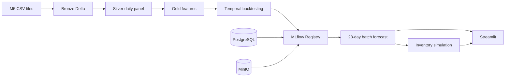

# Retail Demand Forecasting and Inventory Optimization

An end-to-end retail forecasting platform that runs locally and mirrors the working patterns of
Databricks, Delta Lake, and MLflow. It ingests the M5 dataset, builds a medallion lakehouse,
evaluates global forecasting models through temporal backtesting, explains their predictions,
and turns the selected forecast into inventory decisions.

## Resumen ejecutivo

Este proyecto reproduce en local un flujo productivo de forecasting retail. Los datos M5 se
procesan con Spark y Delta Lake en capas Bronze, Silver y Gold. Los experimentos, modelos y
promociones se gestionan con MLflow, PostgreSQL y MinIO. El sistema compara baselines,
LightGBM, XGBoost y N-HiTS, genera explicaciones y simula políticas de reposición con supuestos
de inventario configurables. La misma lógica se ejecuta desde CLI y notebooks documentados.

## Architecture



Spark 3.5 and Delta Lake 3.3 provide the local lakehouse. MLflow stores metadata in PostgreSQL
and model artifacts in the S3-compatible MinIO service. The pipeline, JupyterLab, and dashboard
share the same code, configuration, volumes, and MLflow tracking endpoint.

Docker uses small multi-stage targets instead of one universal image. Spark nodes contain only
the lakehouse stack, MLflow and Streamlit have dedicated runtimes, and Jupyter extends the
training image. The default `dev` targets use CPU PyTorch. Optional `full` targets add the CUDA
wheel for XGBoost and N-HiTS; LightGBM uses its prebuilt CPU wheel.

## Quick start

Prerequisites are Docker Desktop, NVIDIA drivers with Docker GPU support, and the five M5 files
in `data/`. The `full` profile requires CUDA; `dev` can fall back to CPU.

```powershell
Copy-Item .env.example .env
docker-compose build
docker-compose up -d postgres minio minio-init mlflow spark-master spark-worker
docker-compose run --rm pipeline retail-forecast preflight --profile dev
docker-compose run --rm pipeline retail-forecast pipeline run --profile dev
docker-compose up -d dashboard jupyter
```

Build the CUDA targets only when running the full profile:

```powershell
docker compose --profile full build pipeline-gpu jupyter-gpu
docker compose --profile full run --rm pipeline-gpu
```

Open the local services after the health checks pass:

| Service | URL |
| --- | --- |
| Streamlit | `http://localhost:8501` |
| MLflow | `http://localhost:5000` |
| JupyterLab | `http://localhost:8888` |
| Spark master | `http://localhost:8080` |
| MinIO console | `http://localhost:9001` |

The pipeline is restartable. A completed stage is skipped when its configuration fingerprint has
not changed. Use `--force` only when a deliberate rebuild is required.

## Profiles

`dev` selects 300 SKU-store series per state, keeps the production graph on CPU, uses three
Optuna trials, and targets a 15 to 30 minute feedback loop. `full` processes all 30,490 series,
uses the optional CUDA image, runs twelve tuning trials, and targets a one to four hour run.
`test` is a small integration profile used by CI.

Configuration is layered from `config/base.yaml` and one profile file. Paths, forecast horizon,
folds, features, promotion guardrails, and inventory assumptions are validated by Pydantic before
a stage starts.

## CLI

```text
retail-forecast preflight --profile dev
retail-forecast data download --profile dev
retail-forecast data validate --profile dev
retail-forecast pipeline run --profile dev [--from silver] [--to forecasting] [--force]
retail-forecast pipeline status --profile dev
retail-forecast model backtest --profile dev
retail-forecast model train --profile dev
retail-forecast model promote --profile dev --run-id <mlflow-run-id>
retail-forecast forecast run --profile dev
retail-forecast inventory simulate --profile dev
retail-forecast notebooks run --profile dev --notebook all
```

## Notebooks

The `notebooks/` directory contains an editable sequence from environment validation through
inventory optimization. Each notebook has a Papermill parameters cell, explains the relevant
decision and leakage risk, and calls the tested package functions. Executed copies are written to
`artifacts/notebooks/` and are not committed.

The model notebooks launch real MLflow experiments. The backtesting notebook runs the complete
selection policy and the final forecast notebook materializes the registered result. Business
logic is not duplicated in cells.

## Evaluation and promotion

Backtests use origins `d_1857`, `d_1885`, and `d_1913`, each with a 28-day horizon. WRMSSE is
calculated over the 12 official M5 levels using bottom-up coherent forecasts. MAE, WAPE, bias,
RMSSE, and 90 percent interval coverage provide diagnostic context.

The Registry alias `champion` is updated only when the candidate improves WRMSSE by at least one
percent and satisfies the configured bias, coverage, and fold guardrails. The forecast job writes
continuous demand expectations; inventory rules decide any operational rounding.

## Data and generated artifacts

M5 source files, Delta tables, service state, models, executed notebooks, and credentials are
ignored by Git. The source data is validated by filename, schema, size, and checksum. See
[`docs/data-contracts.md`](docs/data-contracts.md) for the table contracts and
[`docs/operations.md`](docs/operations.md) for recovery procedures.

## Development

```powershell
docker-compose run --rm pipeline ruff check src tests app
docker-compose run --rm pipeline mypy src
docker-compose run --rm pipeline pytest -m "not integration and not notebook"
docker-compose run --rm pipeline pytest -m integration
docker-compose config --quiet
```

Further design detail is available in [`docs/architecture.md`](docs/architecture.md),
[`docs/modeling.md`](docs/modeling.md), and [`docs/inventory.md`](docs/inventory.md).
